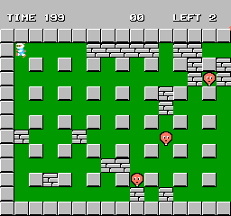
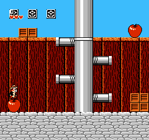
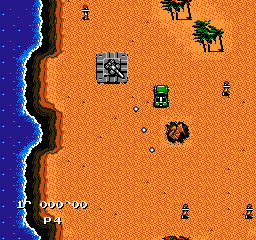
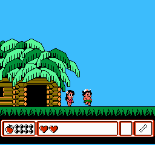
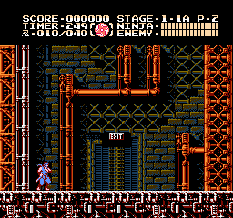
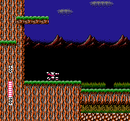

# NesX

my nes project

### 环境

> 可以使用Clion来进行编译和调试(可参考 https://lazyfoo.net/tutorials/SDL/01_hello_SDL/index.php 进行不同平台SDL的配置)

#### Windows (MinGW)
1. 安装 msys2 (https://www.msys2.org/) 并按照网站的 `Installation` 下的指引完成环境的初始化
2. 打开 MSYS2 MinGW 64-bit 安装SDL2库
```bash
pacman -S mingw-w64-x86_64-SDL2 --noconfirm
```
3. 安装cmake (使用MSYS Makefiles)
```bash
pacman -S mingw-w64-x86_64-cmake --noconfirm
```

> 使用Clion需要将MinGW配置到Toolchains中去(还需要gdb)

#### 其他平台(Linux/Unix/Mac)

> ubuntu平台可以使用如下命令安装
>
> ```shell
> sudo apt-get install libsdl2-2.0
> sudo apt-get install libsdl2-dev
> sudo apt-get install cmake
> ```

其他环境可参考 
https://lazyfoo.net/tutorials/SDL/01_hello_SDL/ 来安装SDL2

https://cmake.org/documentation/ 来安装cmake(也可以通过不同平台的包管理来安装)

### 编译

#### Windows (MinGW)

> 定位到 Sources/MySelf/NesX 目录

1. 使用cmake生成Makefile
```bash
cmake -S . -G "MSYS Makefiles" -B build
```

2. 进入build目录
```bash
cd build
```

3. 构建exe文件
```bash
make
```

> 单独运行程序要求 SDL2.dll, libstdc++-6.dll, libgcc_s_seh-1.dll 动态库和exe在相同目录下

> 删除build目录就可以清除cmake,make产生的所有文件

#### 其他平台

> 因为使用cmake, 所以和Windows平台类似, 只是在构建时使用如下命令

```shell
cmake -S . -G "Unix Makefiles" -B build
```
> 或使用默认的Generators

```shell
cmake -S . -B build
```

### 已测试游戏(Mapper 0~4)
1. 炸弹人
2. 火箭车
3. 敲冰块
4. 越野机车
5. 气球大战
6. 红巾特工队
7. 碰碰车
8. 超惑星战记
9. 最终幻想1 英文版
10. 塞尔达1
11. 狡猾飞天德
12. 龙战士3
13. 洛克人2
14. 银河战士
15. 光之神话
16. 恶魔城2
17. 忍者龙剑传1
18. 古巴战士
19. 雪人兄弟
20. 松鼠大作战1
21. 松鼠大作战2
22. 大金刚1
23. 冒险岛1
24. 碰碰飞车
25. 反重力战士
26. 冒险岛4
27. 忍者龙剑传2
28. 忍者龙剑传3
29. 超级马里奥兄弟2
30. 超级马里奥兄弟3
31. 赤影战士
32. 功夫猫党
33. 米老鼠3
34. 成龙之龙
35. 魂斗罗力量
36. 热血足球
37. 热血新纪录

### 相关截图





### 参考资料

http://nesdev.com

https://fms.komkon.org/EMUL8/HOWTO.html

https://fms.komkon.org/EMUL8/NES.html

https://patater.com/gbaguy/nesasm.htm

https://fms.komkon.org

https://www.zophar.net

http://emuprog.free.fr (法)

https://www.emuparadise.me

https://gamefaqs.gamespot.com/nes/916386-nes/faqs/2949

https://www.cnblogs.com/memset/archive/2012/07/18/everynes_nes_specifications.html

http://nemulator.com/files/nes_emu.txt

https://medium.com/@bokuweb17/writing-an-nes-emulator-with-rust-and-webassembly-d64de101c49d

http://www.dustmop.io/blog/2015/04/28/nes-graphics-part-1 (*)

https://github.com/AndreaOrru/LaiNES

https://github.com/aaronmell/6502Net

https://www.qmtpro.com/~nes/nintendulator/

http://www.chrismcovell.com/NESTechFAQ.html

http://content.atalasoft.com/atalasoft-blog/why-writing-an-emulator-is-fun-and-why-you-should-too

http://emulation.gametechwiki.com/index.php/Overclocking

https://codebase64.org/doku.php?id=base:6502_6510_coding

https://www.masswerk.at/6502/6502_instruction_set.html

http://www.my-testsite.co.uk/sites/cc/6502.html

http://nparker.llx.com/a2/index.html

http://nesdev.com/6502.txt

https://en.wikipedia.org/wiki/Frequency
